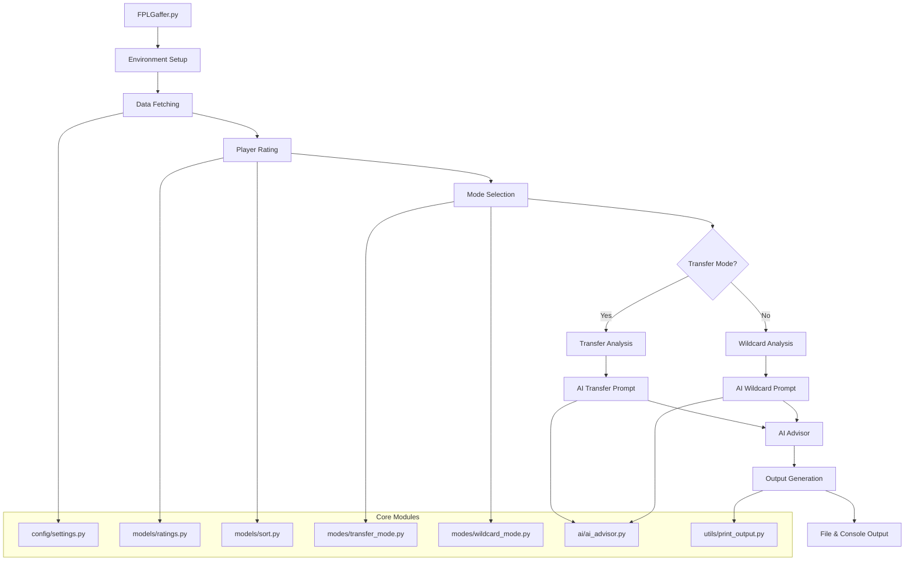
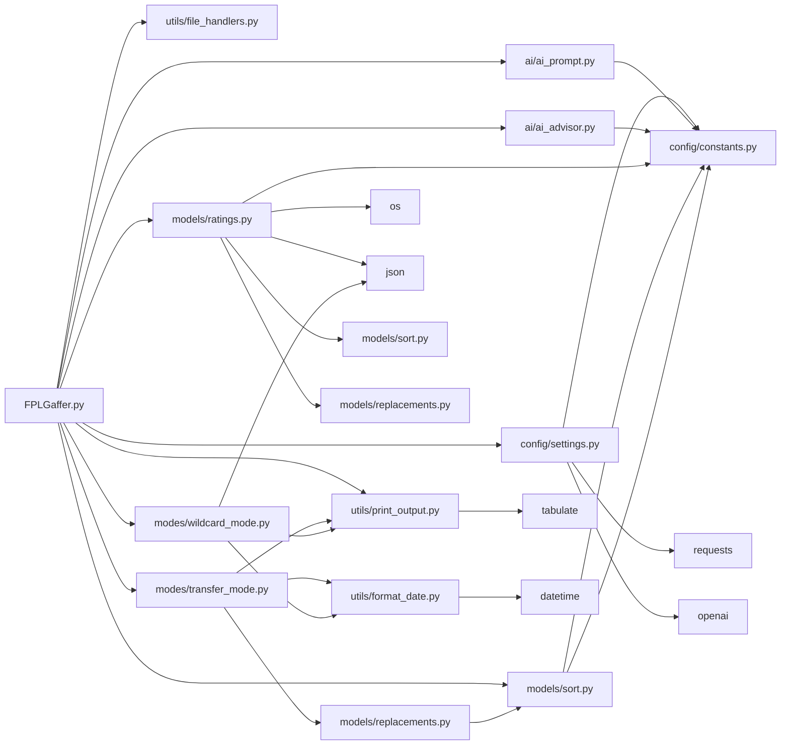

# FPLGaffer Architecture Reference

## System Overview

**FPLGaffer** is a Python-based Fantasy Premier League assistant that provides data-driven player analysis and AI-powered recommendations for team management. The system operates in two distinct modes:

- **Transfer Mode**: Analyzes current team performance and suggests optimal player replacements
- **Wildcard Mode**: Builds optimal 15-player squads from scratch within FPL constraints

The application fetches real-time data from the official FPL API, applies machine learning-based player ratings, and optionally integrates with Groq AI for intelligent recommendations.

## Architecture Flow



## File/Module Inventory

### Entry Point
- **FPLGaffer.py**: Main application orchestrator that coordinates all system components and handles user interaction

### Configuration Layer (`config/`)
- **constants.py**: Global constants including API endpoints, position mappings, AI configuration, and rating weights for different modes
- **settings.py**: Core data fetching and API client management, environment validation, and team data processing

### AI Layer (`ai/`)
- **ai_advisor.py**: Groq AI client integration with fallback logic between free/paid API tiers
- **ai_prompt.py**: System prompt templates for transfer and wildcard recommendation modes

### Data Models (`models/`)
- **ratings.py**: Machine learning-based player rating computation using QuantileTransformer and weighted scoring
- **sort.py**: Player sorting by position, rating normalization, and current team organization
- **replacements.py**: Replacement candidate discovery with budget and availability constraints

### Operation Modes (`modes/`)
- **transfer_mode.py**: Transfer analysis interface, replacement suggestion generation, and AI prompt preparation
- **wildcard_mode.py**: Wildcard squad building interface and top player display by position

### Utilities (`utils/`)
- **file_handlers.py**: Output file management with unique naming and stdout redirection (Tee class)
- **print_output.py**: Formatted table printing using tabulate, AI response formatting, and replacement impact analysis
- **format_date.py**: Date formatting with ordinal suffixes for report headers

## Dependency Map



### Core Dependencies
- **External Libraries**: `requests`, `openai`, `pandas`, `numpy`, `scikit-learn`, `tabulate`, `python-dotenv`
- **Internal Dependencies**: Clear hierarchical structure with minimal circular dependencies

### Entry Points
- **Primary**: `FPLGaffer.py` - Main application entry point
- **Configuration**: Environment variables loaded via `.env` file

## Data Flow

### 1. Initialization Phase
```
Environment Variables → settings.validate_team_id() → AI Client Setup
```

### 2. Data Acquisition Phase
```
FPL API → settings.fetch_bootstrap_data() → settings.format_all_players() → Player Objects
```

### 3. Rating Computation Phase
```
Player Objects → ratings.compute_ml_ratings() → ML Scaling → Weighted Scoring → Rated Players
```

### 4. Processing Phase (Transfer Mode)
```
Rated Players → sort.sort_players() → Position Groups → transfer_mode.transfer() → Replacement Analysis → AI Prompt
```

### 5. Processing Phase (Wildcard Mode)
```
Rated Players → sort.sort_players() → Top Players by Position → wildcard_mode.wildcard() → AI Prompt
```

### 6. AI Integration Phase
```
AI Prompt → ai_advisor.ai_fpl_helper() → Groq API → Formatted Response
```

### 7. Output Phase
```
All Data → print_output.print_*() → Formatted Tables → file_handlers.Tee() → Console + File
```

## Key Interactions

### Transfer Mode Flow
1. **Team Assessment**: `transfer_mode.py:34-41` displays current team sorted by performance rating
2. **Replacement Discovery**: `replacements.py:21-31` filters candidates by budget, availability, and team constraints
3. **AI Integration**: `ai_advisor.py:28-44` handles API calls with automatic fallback between free/paid tiers
4. **Output Generation**: `print_output.py:59-81` shows financial impact and rating comparisons

### Wildcard Mode Flow
1. **Player Selection**: `wildcard_mode.py:32-37` extracts top performers by position
2. **Constraint Validation**: AI prompt enforces FPL rules (position counts, budget, team limits)
3. **Squad Optimization**: AI selects optimal 15-player squad within constraints

### Rating System Interaction
1. **ML Scaling**: `ratings.py:36-47` applies QuantileTransformer for normalized scoring
2. **Weight Application**: `ratings.py:49-57` combines multiple attributes using mode-specific weights
3. **Multiplier Effects**: `ratings.py:68-85` applies availability, fixture difficulty, and team strength multipliers

## Extension Points

### Adding New Rating Attributes
1. **Update Constants**: Add new attributes to `WC_WEIGHTS` and `TRANSFER_WEIGHTS` in `config/constants.py:31-102`
2. **Data Fetching**: Ensure attribute is included in `settings.py:162-199` player formatting
3. **Weight Tuning**: Adjust weights based on attribute importance for each mode

### Adding New Operation Modes
1. **Create Mode Module**: Follow pattern of `modes/transfer_mode.py` and `modes/wildcard_mode.py`
2. **Update Main Script**: Add mode selection logic in `FPLGaffer.py:28-38`
3. **Add AI Prompts**: Create system prompt in `ai/ai_prompt.py` following existing patterns

### Extending AI Integration
1. **New AI Providers**: Add client initialization in `settings.py:26-68`
2. **Prompt Engineering**: Modify system prompts in `ai/ai_prompt.py` for different AI behaviors
3. **Response Processing**: Update parsing logic in `ai_advisor.py:67-70`

### Output Format Extensions
1. **New Display Formats**: Add functions to `utils/print_output.py` following `print_players()` pattern
2. **Export Formats**: Extend `utils/file_handlers.py` for CSV, JSON, or other export types
3. **Report Customization**: Modify mode-specific output formatting in respective mode modules

### Data Source Extensions
1. **Additional APIs**: Add new data fetching functions to `config/settings.py`
2. **Caching Layer**: Implement data caching between API calls
3. **Real-time Updates**: Add webhook or polling mechanisms for live data updates

## Architecture Strengths

- **Modular Design**: Clear separation of concerns with dedicated layers for configuration, AI, models, modes, and utilities
- **Flexible Rating System**: ML-based normalization with configurable weights for different use cases
- **Robust AI Integration**: Automatic fallback between API tiers with comprehensive error handling
- **Extensible Output**: Dual console/file output with formatted tables and unique file naming
- **Data Integrity**: Comprehensive validation and safe conversion functions for API data

## Performance Considerations

- **API Efficiency**: Single bootstrap data fetch with local processing to minimize API calls
- **ML Scaling**: QuantileTransformer provides efficient normalization for large player datasets
- **Memory Management**: Streaming processing and careful data structure design
- **Caching Opportunities**: Fixture and team data could be cached between runs for improved performance